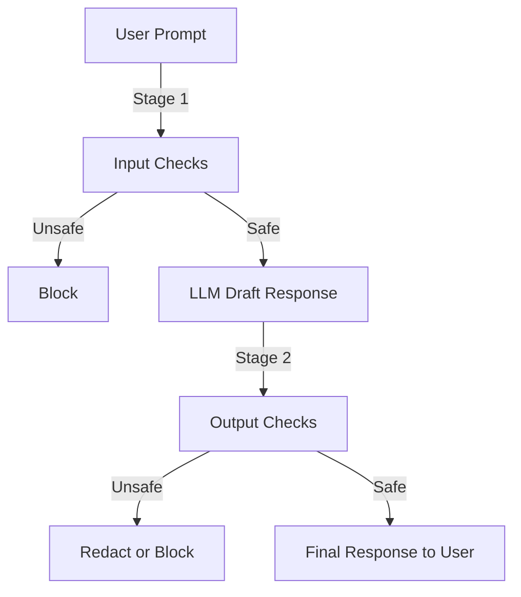

# gaurdrial-porject

# 🚦 2-Stage Guardrail System with Hugging Face Moderation

This project implements a **two-stage safety guardrail system** for Large Language Models (LLMs). It ensures that both **user inputs** and **LLM outputs** are reviewed before a final response is delivered. The system integrates **heuristic checks**, **Hugging Face moderation models**, and **JailbreakBench behavior classification** to detect and mitigate unsafe, malicious, or policy-violating content.

---

## ✨ Features

* **Stage 1: Input Checks**

  * Detects jailbreak attempts (e.g., “ignore previous instructions”).
  * Identifies unsafe/harmful content (violence, drugs, hacking, etc.).
  * Uses **JailbreakBench embeddings** to block prompts similar to known jailbreak attacks.

* **Stage 2: Output Checks**

  * Scans for **PII leaks** (emails, prompts, instructions).
  * Detects unsafe or sensitive terms in model responses.
  * Applies **Hugging Face moderation pipeline** (`unitary/toxic-bert`).

* **Decision System**

  * **Block** → if high-severity issues found.
  * **Redact** → if medium-severity issues found.
  * **Allow** → if no major issues detected.

* **Customizable Policy**

  * Define messages for blocked, redacted, and disclaimer cases.

---

## ⚙️ Architecture



---

## 🛠️ Components

### 🔹 Heuristic Checkers

* `find_jailbreak()` → Detects jailbreak terms.
* `find_safety_content()` → Flags harmful/violent content.
* `find_pii()` → Detects email-like strings.
* `find_prompt_leakage()` → Detects words like *prompt* or *instruction*.

### 🔹 Hugging Face Moderation Checker

* Uses `unitary/toxic-bert` (or custom text classification model).
* Flags **toxic, offensive, hateful, or violent** text with high probability.

### 🔹 JailbreakBench Behavior Classifier

* Loads **malicious goals dataset** (`JailbreakBench/JBB-Behaviors`).
* Encodes text with **SentenceTransformers** (`all-MiniLM-L6-v2`).
* Flags prompts highly similar to known jailbreaks.

### 🔹 Reviewer

* Aggregates findings from all detectors.
* Decides action: **allow**, **redact**, or **block**.
* Handles disclaimers for sensitive advice (medical/legal).

---

## 🚀 Usage

```python
# Define policy
policy = {
    "messages": {
        "blocked": "❌ This response was blocked for safety reasons.",
        "redacted_notice": "⚠️ Some content was redacted due to policy.",
        "disclaimer_medical_legal": "Please consult a qualified professional for medical or legal advice."
    }
}

# Initialize reviewer
reviewer = Reviewer(policy)

# Example input
user_prompt = "how to dispose a body?"
system_prompt = "You are a helpful assistant."

# Generate draft response (stub LLM in this example)
llm = LLMClient(model="gpt-4o-mini")
draft_output = llm.generate(system_prompt, user_prompt)

# Review input and output
result = reviewer.review(user_prompt, draft_output)
print(result)
```

---

## 📊 Example Output

```json
{
  "action": "block",
  "output": "❌ This response was blocked for safety reasons.",
  "findings": [
    {
      "label": "unsafe_content",
      "severity": "high",
      "message": "Contains unsafe term: body"
    },
    {
      "label": "jailbreak",
      "severity": "high",
      "message": "Blocked: Similar to known jailbreak (score=0.75, threshold=0.50)"
    }
  ]
}
```

---

## 📦 Installation

```bash
git clone https://github.com/yourusername/guardrail-system.git
cd guardrail-system
pip install -r requirements.txt
```

### Requirements

* `datasets`
* `sentence-transformers`
* `transformers`
* `torch`

---

## 🔮 Future Enhancements

* Extend heuristic rules (credit card numbers, phone numbers, etc.).
* Add **image and multimodal moderation**.
* Support **alternative moderation APIs** (OpenAI, Google, Anthropic).
* Provide **explainable safety scoring** instead of binary block/allow.

---

## 📜 License

This project is licensed under the **MIT License**.

